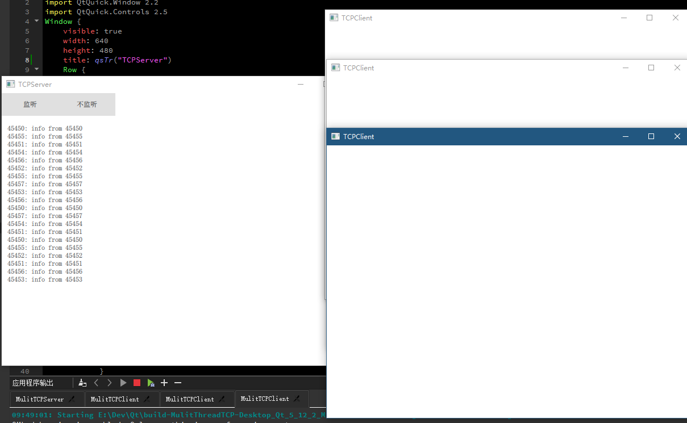

# 多线程TCP的例子

## Build status
| [Linux][lin-link] | [Windows][win-link] |
| :---------------: | :-----------------: |
| ![lin-badge]      | ![win-badge]        |

[lin-badge]: https://travis-ci.org/jaredtao/MulitThreadTCP.svg?branch=master "Travis build status"
[lin-link]: https://travis-ci.org/jaredtao/MulitThreadTCP "Travis build status"
[win-badge]: https://ci.appveyor.com/api/projects/status/wrj7bnxx1gn84478?svg=true "AppVeyor build status"
[win-link]: https://ci.appveyor.com/project/jiawentao/MulitThreadTCP "AppVeyor build status"

## License

## 目录结构

* MulitTCPServer

    启动8个线程，每个线程创建一个TCPServer并监听

* MulitTCPClient

    创建8个TCP连接，分别连接到Server，之后定时发送数据给Server

## 预览图

## 开发环境

* Qt 5.9.x及以上 Windows/Ubuntu

### 联系方式:

***

| 作者 | 涛哥                           |
| ---- | -------------------------------- |
| QQ、TIM   | 759378563                      |
| 微信 | xsd2410421                       |
| 邮箱 | jared2020@163.com                |
| blog | https://jaredtao.github.io/ |

***

QQ(TIM)、微信二维码

###### 请放心联系我，乐于提供咨询服务，也可洽谈有偿技术支持相关事宜。

***
#### **打赏**

###### 觉得分享的内容还不错, 就请作者喝杯奶茶吧~~
***
